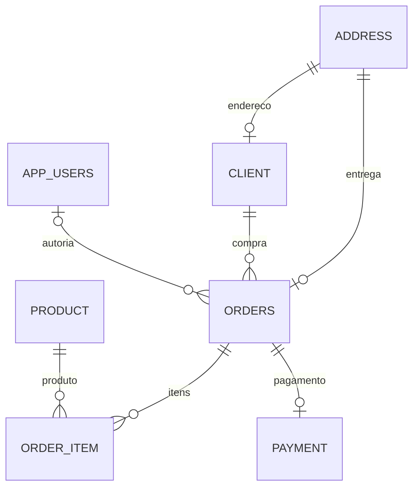

# BD-01 — modelo lógico atual e dicionário mínimo

Atualizado em 04/10/2026 por **Matheus Siqueira**. Fonte: entidades JPA e migrações V1/V2. Este documento descreve o modelo implementado; estoque, metas e custos históricos ainda não existem.

| Tabela | Chave e conteúdo | Relações e restrições atuais |
| --- | --- | --- |
| `address` | `id` bigint identity; rua, número, complemento, bairro, cidade, estado e CEP em varchar(255) | Referenciada por cliente e endereço de entrega. |
| `client` | `id` bigint identity; `client_type`, nome, email, data de nascimento, CPF, CNPJ, razão social | `address_id` FK única; CPF e CNPJ únicos quando preenchidos; herança em tabela única. |
| `product` | `id` bigint identity; `product_type`, nome, preço double, descrição, link digital, peso double | Herança em tabela única; preço ainda não é `NUMERIC`. |
| `orders` | `id` bigint identity; momento, estado | `client_id` FK; `address_id` FK única; `seller_id` FK nullable para `app_users`, indexada. |
| `order_item` | `id` bigint identity; quantidade integer, preço unitário double | `order_id` e `product_id` FKs; o preço é cópia histórica do preço na compra. |
| `payment` | `id` bigint identity; `payment_type`, valor double, estado, data e campos de boleto/cartão/PIX | `order_id` FK única; herança em tabela única. |
| `app_users` | `id` bigint identity; nome, email, hash da senha, papel | Email único; `role` GERENTE/VENDEDOR na aplicação; senha armazenada como hash. |

As FKs impedem referências a linhas inexistentes. As cardinalidades de negócio são indicadas acima; algumas colunas ainda aceitam `NULL` por compatibilidade com o modelo legado, portanto o banco não impõe todas as regras da aplicação. O índice de `orders.seller_id` auxilia consultas futuras por autoria, mas tais consultas ainda não foram implementadas. A política para pedidos antigos mantém `seller_id=NULL`; não atribuir pedidos retrospectivamente sem evidência de autoria.

Pendências para o modelo conceitual completo e normalização: confirmar regras da rubrica docente; desenhar metas, entradas e reservas de estoque; aprovar precisão monetária; definir unicidade e checks após auditar dados existentes. Allan revisa DER/integridade no card BD-01. Veja [procedimento de migração](migracoes.md).
